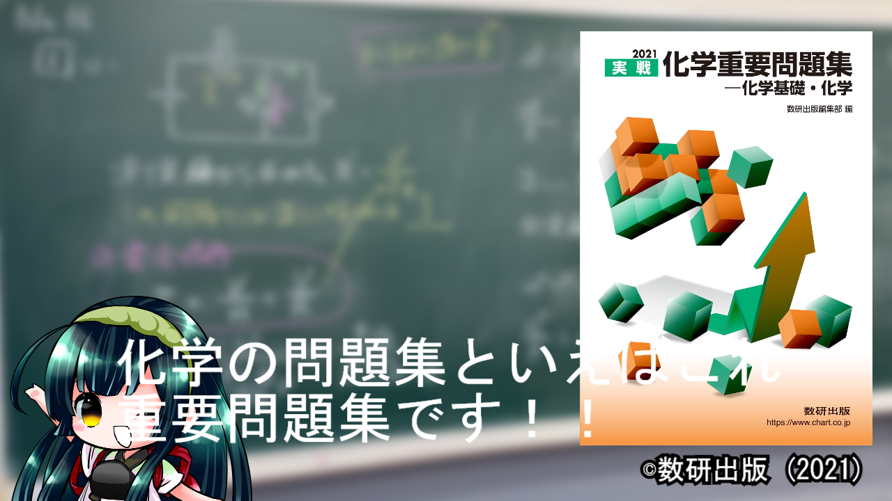

# デザインガイド

動画においてデザインは重要な役割を担っています。
ここではより動画を視覚的に見やすく分かりやすくするためのデザインの一例を示します。

## デザインガイドが必要な理由

※2021実戦 化学重要問題集 化学基礎・化学は©数研出版の書籍です。

口で言うよりも、上の画像を見ていただければわかりやすいと思います。

上の例だと
* テキストと本の表紙が近い色なので見にくい
* キャラがテロップにかぶっている
などといった様々な問題があります。

そういったことがなくなるように、このガイドを読んでいってください。

## スマホユーザーを考慮したデザイン
スマホはおおよそ4.7インチから6.7インチほどのディスプレイサイズです。
あまりに小さい文字の使用はなるべく避けるようにしましょう。

## それぞれのデザインガイド

テキストデザインについては[こちら](./text-design.md)